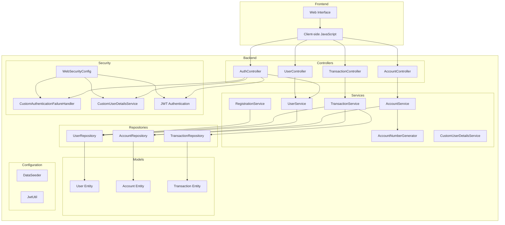
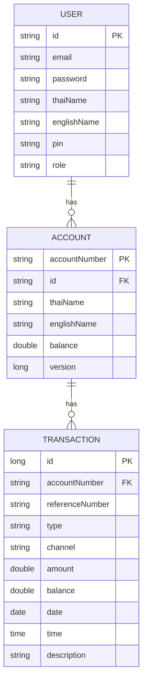

# Banking Application

A Spring Boot-based banking application that provides secure account management and transaction processing capabilities.

## High-Level Design



## Database Entity Relationship Diagram



## Component Descriptions

### Frontend Components

- **Web Interface**: HTML/CSS-based user interface with responsive design
- **Client-side JavaScript**: Handles user interactions, JWT token management, and API calls

### Backend Components

#### Controllers

- **AuthController**: Handles authentication, login operations, and JWT token generation
- **TransactionController**: Manages transaction-related endpoints
- **UserController**: Handles user management operations
- **AccountController**: Manages account creation and operations

#### Services

- **UserService**: Manages user-related business logic
- **TransactionService**: Handles transaction processing and validation
- **AccountService**: Manages account operations
- **AccountNumberGenerator**: Generates unique account numbers
- **CustomUserDetailsService**: Custom Spring Security user details service
- **RegistrationService**: Handles user registration with JPA

#### Repositories

- **UserRepository**: Data access for User entity
- **TransactionRepository**: Data access for Transaction entity
- **AccountRepository**: Data access for Account entity

#### Security

- **CustomAuthenticationFailureHandler**: Handles authentication failures
- **CustomUserDetailsService**: Custom user authentication service
- **WebSecurityConfig**: Spring Security configuration
- **JWT Authentication**: JSON Web Token based authentication

#### Models

- **User**: User entity with authentication details
- **Account**: Account entity with balance information
- **Transaction**: Transaction entity for financial operations

#### Configuration

- **DataSeeder**: Seeds initial data (Teller and Customer accounts)
- **JwtUtil**: JWT token generation and validation

## Key Features

1. Secure JWT-based authentication
2. Account management with role-based access
3. Transaction processing with PIN verification
4. PIN-based security
5. Transaction history tracking
6. Pre-configured user accounts (Teller and Customer)

## Technology Stack

- Spring Boot 3.x
- Spring Security with JWT
- Spring Data JPA
- PostgreSQL
- Maven
- JUnit 5 for testing
- Thymeleaf for templating
- Docker for containerization
- OpenAPI 3.0.3 for API documentation

## Getting Started

### Prerequisites

- Java 17 or higher
- Maven
- PostgreSQL
- Docker and Docker Compose

### Local Development Setup

1. Set up PostgreSQL database
2. Configure `application.properties` with database credentials
3. Set up JWT secret in environment variables:
   ```bash
   export JWT_SECRET=your-secret-key
   ```
4. Run the application using Maven:
   ```bash
   mvn spring-boot:run
   ```

### Docker Deployment

1. Create a `.env` file in the project root:

   ```bash
   # Database Configuration
   POSTGRES_DB=banking
   POSTGRES_USER=postgres
   POSTGRES_PASSWORD=your-secure-password

   # JWT Configuration
   JWT_SECRET=your-secure-jwt-secret
   ```

2. Build and start the containers:

   ```bash
   docker-compose up --build
   ```

3. Access the application:
   - Web Interface: http://localhost:8080
   - API Endpoints: http://localhost:8080/api

### Docker Configuration

The application uses a multi-stage Docker build process:

1. **Build Stage**:

   - Uses Maven to build the application
   - Creates a JAR file with all dependencies

2. **Run Stage**:

   - Uses JRE Alpine for a minimal runtime
   - Configures security and user permissions
   - Exposes port 8080

3. **Docker Compose Services**:
   - **app**: Spring Boot application
   - **db**: PostgreSQL database

### Running Tests

```bash
# Local testing
mvn test

# Docker testing
docker-compose run app mvn test
```

### Building the Application

```bash
# Local build
mvn clean install

# Docker build
docker-compose build
```

## Security Features

- JWT-based authentication
- Password encryption
- PIN-based transaction verification
- Session management
- CSRF protection
- Secure password storage
- Role-based access control

## Duplicate Avoidance Mechanisms

The application implements several mechanisms to prevent duplicate records and operations:

- **Database Constraints**: Unique constraints are enforced at the database level (e.g., unique account numbers, unique user emails, unique transaction reference numbers) to prevent duplicate entries.
- **Transaction Isolation**: Critical operations such as account creation and transaction processing use SERIALIZABLE isolation to avoid race conditions and ensure data consistency.
- **Application-Level Checks**: Before creating new accounts or processing transactions, the application checks for existing records to avoid duplicates.
- **Idempotency**: Transaction reference numbers are generated using UUIDs to ensure each transaction is unique and can be safely retried without duplication.
- **Optimistic Locking**: The Account entity uses a version field to prevent concurrent updates from causing duplicate or inconsistent data.

These mechanisms work together to ensure data integrity and prevent duplicate accounts, users, or transactions in the system.

## API Documentation

The application uses OpenAPI 3.0.3 specification for API documentation. The complete API specification is available in `openapi.yaml` at the root of the project.

### Viewing API Documentation

1. Using Swagger UI (if enabled):

   ```
   http://localhost:8080/swagger-ui.html
   ```

2. Using the OpenAPI specification file:
   ```bash
   # View the specification
   cat openapi.yaml
   ```

### API Specification Details

The OpenAPI specification includes:

- Complete API endpoints documentation
- Request/response schemas
- Security requirements (JWT authentication)
- Data models and their properties
- Error responses and status codes
- Example request/response payloads

### Key API Components

1. **Security Schemes**:

   - JWT Bearer token authentication
   - Role-based access control (TELLER, CUSTOMER)

2. **Data Models**:

   - User
   - Account
   - Transaction
   - LoginRequest/Response
   - Error

3. **API Categories**:
   - Authentication
   - Account Management
   - Transaction Operations
   - User Management

## API Endpoints

The following endpoints are documented in detail in the OpenAPI specification (`openapi.yaml`):

### Authentication

- `POST /auth/login`: User authentication (returns JWT token)

  - Required fields: email, password
  - Returns: JWT token and user role

- `POST /register`: User registration
  - Required fields: email, password, id, thaiName, englishName, pin, role
  - Returns: Created user details

### Account Management

- `POST /api/account/create`: Create new account (requires TELLER role)

  - Required fields: id, thaiName, englishName
  - Returns: Created account details

- `GET /api/account/{accountNumber}`: Get account details
  - Returns: Account information including balance

### Transaction Operations

- `POST /api/transactions/deposit`: Deposit funds

  - Required fields: accountNumber, amount
  - Returns: Transaction details

- `POST /api/transactions/transfer`: Transfer funds

  - Required fields: sourceAccountNumber, destinationAccountNumber, amount, pin
  - Returns: Transaction details

- `GET /api/transactions/{accountNumber}`: Get transaction history
  - Returns: Array of transactions

### User Management

- `GET /api/users/{email}`: Get user details
  - Returns: User information

For complete API documentation including request/response schemas, error codes, and examples, refer to the OpenAPI specification file.

## Pre-configured Accounts

### Teller Account

- Email: teller@bank.com
- Password: password
- PIN: 1234
- Role: TELLER

### Customer Account

- Email: customer@example.com
- Password: password
- PIN: 5678
- Role: CUSTOMER

```
